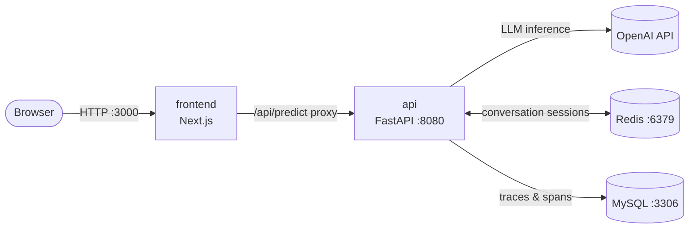
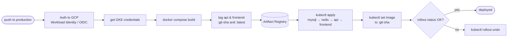

# EHR & Transcript Consolidation Service

A service that watches a live clinical conversation and, chunk by chunk, compares
what is being said against the patient's existing Electronic Health Record (EHR).
When the transcript and the record disagree — or the transcript adds information
the record is missing — it emits **notifications**, each optionally carrying a
concrete **edit suggestion** for the EHR.

It is packaged as two application services (a Python API and a Next.js frontend)
backed by Redis and MySQL. It runs locally with Docker Compose, on a local
Kubernetes cluster (minikube), and in production on **Google Kubernetes Engine
(GKE Autopilot)**, deployed automatically by a **GitHub Actions CI/CD pipeline**.

---

## Architecture



- The **browser only ever talks to the frontend.** The frontend proxies prediction
  calls to the API server-side, which keeps the API URL out of the client bundle and
  sidesteps CORS.
- The **API** performs the actual comparison using an LLM agent, remembers the
  conversation in **Redis**, and records execution traces in **MySQL**.

### How one prediction works

The API exposes `POST /v1/predict`. It is designed to be called repeatedly as a
conversation streams in:

1. **First call** — the client sends `session_id: null`, the **full `ehr_data`**, and
   the first `transcript_chunk`. The API creates a Redis-backed session, runs the
   agent, and returns a `session_id` alongside any notifications.
2. **Subsequent calls** — the client passes the returned `session_id` and only the
   next `transcript_chunk`. The EHR context and prior turns live in the Redis session,
   so each call stays small.

A response is a list of `notifications`, each with a `type`
(`information_missing` | `information_conflict`), a `message`, and an optional
`suggested_edit` (`add` / `replace` / `remove` against a field path in the EHR).

### Demo 

Here is a short video showing the processing of a fictional medical encounter in the context of the patient's EHR summary data. The frontend shows notifications popping up and, some of them, include important edit suggestions to make the EHR summary align with the information collected during the medical encounter.

<p align="center">
  <a href="https://www.youtube.com/watch?v=vZOHQUEYVy8">
    
  </a>
</p>

---

## Repository structure

```
.
├── .github/workflows/
│   ├── tests-formatter-and-linter.yaml  # CI: pytest + ruff + mypy on main/production
│   └── deploy.yaml                       # CD: build, push to Artifact Registry, deploy to GKE
├── compose.yaml            # Base Docker Compose stack (production images)
├── compose.dev.yaml        # Dev overlay: hot-reload, source bind mounts
├── k8s/                    # Kubernetes manifests (one folder per component)
│   ├── namespace.yaml
│   ├── api/                # Deployment (+ init container), Service, HPA
│   ├── frontend/           # Deployment, Service (LoadBalancer)
│   ├── redis/              # Deployment, Service (ClusterIP)
│   ├── mysql/              # Deployment, Service, PersistentVolumeClaim
│   └── secrets/            # *.example.yaml templates (real secrets are gitignored _*.yaml)
├── scripts/
│   ├── build.sh            # docker build for the api image
│   ├── run.sh              # docker run for the api image (standalone)
│   ├── apply_k8s.ps1       # Local (minikube): build images + apply all manifests
│   └── gke_config.ps1      # One-time GKE / Artifact Registry / Workload Identity setup
└── services/
    ├── api/                # FastAPI service (Python 3.12, uv)
    │   ├── api/
    │   │   ├── main.py     # App, tracing wiring, /health, /version
    │   │   ├── database.py # SQLAlchemy URL for MySQL
    │   │   ├── settings.py # Env-driven configuration
    │   │   └── routers/v1/ # /v1/predict router, service, schemas, config, tracing
    │   └── Dockerfile      # Multi-stage: test → production
    └── frontend/           # Next.js 15 app (Node 22)
        ├── app/
        │   ├── api/predict/route.ts  # Server-side proxy to the API
        │   ├── components/           # EHR panel, input screen, notifications
        │   └── lib/                  # Client-side API helpers
        └── Dockerfile               # Multi-stage: deps → builder → production
```

---

## The services

| Service    | Tech            | Port | Role |
|------------|-----------------|------|------|
| `api`      | FastAPI, Python 3.12 (uv) | 8080 | Core inference API. Runs the LLM agent that compares each transcript chunk to the EHR and produces notifications + edit suggestions. |
| `frontend` | Next.js 15, Node 22 | 3000 | User interface and **server-side proxy** to the API. The only service a browser talks to. |
| `redis`    | Redis           | 6379 | Stores per-conversation **session memory** so repeat calls only need the newest chunk. |
| `mysql`    | MySQL 8.4       | 3306 | Stores agent **traces and spans** for observability (tables `traces`, `spans` in `application_db`). |

### `api`

- **Framework:** FastAPI, served by Uvicorn. Dependencies managed by **uv**.
- **Inference:** uses the OpenAI Agents SDK. Agent behavior (model, instructions,
  prompt templates, output schema) is defined declaratively in
  `api/routers/v1/config/config_001.yaml` and loaded per request.
- **Sessions:** `RedisSession` keyed by a generated `session_id`; requires `REDIS_URL`.
- **Tracing:** a custom `MySQLTracingExporter` wrapped in a `BatchTraceProcessor`
  batches traces/spans and writes them to MySQL. Tables are created at startup.
- **Endpoints:** `POST /v1/predict`, `GET /health`, `GET /version`, `GET /docs`.

### `frontend`

- **Framework:** Next.js (App Router). Built as a **standalone** output for a small
  production image.
- The route `app/api/predict/route.ts` forwards `POST /api/predict` to
  `${API_BASE_URL}/v1/predict`. `API_BASE_URL` is a **server-side** env var
  (defaults to `http://localhost:8080`; set to `http://api:8080` in-cluster).

---

## Configuration

Configuration is supplied as environment variables. **How** they are provided
differs by environment:

- **Docker Compose** reads them from `services/api/.env` (not committed).
- **Kubernetes** reads them from two Secrets — `mysql-secret` and `api-secret` —
  which the pods consume via `envFrom`.

Required keys:

| Variable | Used by | Provided in k8s by | Purpose |
|----------|---------|--------------------|---------|
| `OPENAI_API_KEY` | api | `api-secret` | LLM inference |
| `REDIS_URL` | api | `api-secret` | Session store, e.g. `redis://redis-service:6379` |
| `MYSQL_HOST` | api | `api-secret` / `mysql-secret` | MySQL host (`mysql-service`) |
| `MYSQL_PORT` | api | `api-secret` / `mysql-secret` | MySQL port (`3306`) |
| `MYSQL_USER` / `MYSQL_PASSWORD` | api, mysql | `api-secret` / `mysql-secret` | Application DB credentials |
| `MYSQL_DATABASE` | api, mysql | `api-secret` / `mysql-secret` | Application database name |
| `MYSQL_ROOT_PASSWORD` | mysql | `mysql-secret` | Root password for DB initialization |
| `API_BASE_URL` | frontend | Deployment `env` | URL of the API (server-side only) |

### Kubernetes secrets

Real secrets are **not committed**. The repo ships templates and gitignores the
concrete files (`k8s/secrets/_*.yaml`). To create them:

```bash
cp k8s/secrets/api-secret.example.yaml   k8s/secrets/_api-secret.yaml
cp k8s/secrets/mysql-secret.example.yaml k8s/secrets/_mysql-secret.yaml
# edit the _*.yaml files, filling in the placeholder values, then:
kubectl apply -R -f k8s/secrets/_*.yaml
```

> **Note:** MySQL only provisions `MYSQL_DATABASE` / `MYSQL_USER` on **first
> initialization of an empty data directory**. The credentials in `api-secret` must
> match the ones MySQL was initialized with from `mysql-secret`.

---

## Running locally with Docker Compose

Prerequisites: Docker Desktop, and a populated `services/api/.env`.

### Production-like stack

```bash
docker compose up --build
```

- Frontend: <http://localhost:3000>
- API docs: <http://localhost:8080/docs>

The API waits for MySQL to be healthy before starting (`depends_on`), and reaches
Redis/MySQL over the Compose network by service name.

### Development (hot reload)

The `compose.dev.yaml` overlay mounts source into the containers and swaps in
dev commands (`uvicorn --reload` for the API, `next dev` for the frontend):

```bash
docker compose -f compose.yaml -f compose.dev.yaml up --build
```

> The dev overlay builds the frontend’s `builder` stage. Do **not** reuse that image
> for Kubernetes — its default command is the bare `node` REPL, which exits
> immediately outside Compose. Always build the `production` target for the cluster.

---

## Deployment (GKE + CI/CD)

Production runs on **GKE Autopilot** (`autopilot-cluster-1`, region
`southamerica-east1`) and is deployed automatically by GitHub Actions.

### Continuous integration — `tests-formatter-and-linter.yaml`

Runs on every push and pull request to `main` and `production`. Across a
Python 3.11 / 3.12 / 3.13 matrix it runs:

- `uv run pytest` — tests
- `uv run ruff check .` — lint
- `uv run mypy .` — type check

### Continuous deployment — `deploy.yaml`

Runs on every push to the **`production`** branch:



Key properties:

- **Keyless auth** via Workload Identity Federation (no long-lived service-account
  keys) — the workflow requests an OIDC token (`id-token: write`).
- Images are pushed to **Artifact Registry** tagged with both the immutable
  `${{ github.sha }}` and `latest`. Deployments are pinned to the **git-sha** tag so
  each rollout is reproducible.
- **Automatic rollback:** if either the `api` or `frontend` rollout doesn't become
  ready within 120s, the job runs `kubectl rollout undo` and fails.

The pipeline deploys **workloads only** — the namespace and the two Secrets are
bootstrapped once during cluster setup (see below), not on every deploy.

### Required GitHub Actions secrets

`GCP_WORKLOAD_IDENTITY_PROVIDER`, `GCP_SERVICE_ACCOUNT`, `GCP_PROJECT_ID`,
`GCP_REGION`, `GKE_NAMESPACE`.

### One-time GKE bootstrap

`scripts/gke_config.ps1` documents the full first-time setup: creating the Autopilot
cluster, the Artifact Registry Docker repo, a reserved regional static IP
(`frontend-ip`) for the frontend load balancer, the Workload Identity pool/provider
and service-account bindings for GitHub, and the initial `kubectl apply` of the
namespace and secrets.

### GKE-specific manifest choices

| Concern | Choice |
|---------|--------|
| Container images | Artifact Registry: `southamerica-east1-docker.pkg.dev/ehr-transcript-consolidation/ehr-transcript-consolidation-docker-repo/{api,frontend}` |
| MySQL storage | Dynamically provisioned PVC with `storageClassName: standard-rwo` (GKE Autopilot default) — no manually managed PV |
| Frontend exposure | `Service type: LoadBalancer` with `loadBalancerClass: networking.gke.io/l4-regional-external`, the reserved static IP via `networking.gke.io/load-balancer-ip-addresses: frontend-ip`, listening on **port 80** |
| Redis / MySQL | `ClusterIP` — internal only, never exposed |
| Autoscaling | `api` HPA (CPU-target, 1–5 replicas); Autopilot provides metrics out of the box |

---

## Running on Kubernetes locally (minikube)

The manifests are GKE-targeted, so local minikube runs need the image references
pointed at locally-built images.

### 1. Start the cluster and metrics

```bash
minikube start
minikube addons enable metrics-server
```

### 2. Create secrets

```bash
cp k8s/secrets/api-secret.example.yaml   k8s/secrets/_api-secret.yaml
cp k8s/secrets/mysql-secret.example.yaml k8s/secrets/_mysql-secret.yaml
# fill in the _*.yaml placeholders
```

### 3. Build images and apply manifests

`scripts/apply_k8s.ps1` builds `api:latest` / `frontend:latest` into minikube’s
Docker daemon, then applies the namespace, secrets, and all workloads:

```powershell
powershell -File scripts/apply_k8s.ps1
```

Because the committed Deployments reference the **Artifact Registry** image paths,
point them at your locally-built images so minikube doesn’t try to pull from GCP:

```bash
kubectl set image deployment/api-deployment api=api:latest -n ehr-transcript-consolidation-service
kubectl set image deployment/frontend-deployment frontend=frontend:latest -n ehr-transcript-consolidation-service
```

### 4. Access the app

The frontend Service is `type: LoadBalancer`, which stays `<pending>` on minikube
(and the GKE load-balancer class is ignored locally). Open it with:

```bash
minikube service frontend -n ehr-transcript-consolidation-service
```

### 5. Verify

```bash
# Pods should all be Running / 1/1
kubectl get pods -n ehr-transcript-consolidation-service

# Trace tables exist and fill after predictions flush (~5s batching window)
kubectl exec -n ehr-transcript-consolidation-service deploy/mysql-deployment -- \
  sh -c 'mysql -uroot -p"$MYSQL_ROOT_PASSWORD" -N -e \
  "SHOW TABLES FROM application_db; SELECT COUNT(*) FROM application_db.spans;"'
```

### Kubernetes components

| Manifest | Kind | Notes |
|----------|------|-------|
| `api/deployment.yaml` | Deployment | `wait-for-mysql` init container; env via `envFrom: api-secret`; replicas managed by the HPA; probes on `/health`. |
| `api/service.yaml` | Service (ClusterIP) | Internal DNS name `api`. |
| `api/hpa.yaml` | HorizontalPodAutoscaler | CPU-target autoscaling, 1–5 replicas. |
| `frontend/*` | Deployment + Service (LoadBalancer) | External entry point on port 80 → container 3000; GKE regional external LB with reserved static IP. |
| `redis/*` | Deployment + Service (ClusterIP) | Session store, DNS name `redis-service`, internal only. |
| `mysql/*` | Deployment + Service + PVC | `Recreate` strategy; env via `envFrom: mysql-secret`; storage via dynamic `standard-rwo` PVC. |
| `secrets/*.example.yaml` | Secret (templates) | Copy to `_*.yaml` (gitignored) and fill in: `api-secret`, `mysql-secret`. |

---

## Operational notes & gotchas

- **Production rollouts are git-sha pinned.** The pipeline deploys the
  `:${github.sha}` image, not `:latest`, so each deploy is reproducible and
  `kubectl rollout undo` returns to a known image.
- **Local minikube needs image overrides.** The manifests reference Artifact
  Registry paths; with `imagePullPolicy: IfNotPresent` minikube would try to pull
  from GCP. Build locally and `kubectl set image` to `api:latest` / `frontend:latest`
  (see the minikube steps above), or build under the full registry path.
- **Rebuild images after code changes** on minikube — the `:latest` tag plus
  `IfNotPresent` keeps running the old image until the pod is recreated:
  ```bash
  kubectl rollout restart deployment/api-deployment -n ehr-transcript-consolidation-service
  ```
- **Resetting the database.** MySQL provisions the app DB/user only on first init of
  an empty volume. On GKE, delete the PVC (`mysql-pv-claim`) — and let the dynamic PV
  be reclaimed — to start fresh. On minikube it’s the same PVC delete; there is no
  longer a hand-managed `hostPath` volume to wipe.
- **PowerShell quoting.** When running `kubectl exec ... -- sh -c '...'` from
  PowerShell, nested double quotes get stripped. Pipe SQL via stdin instead, or run
  it from a bash shell.
